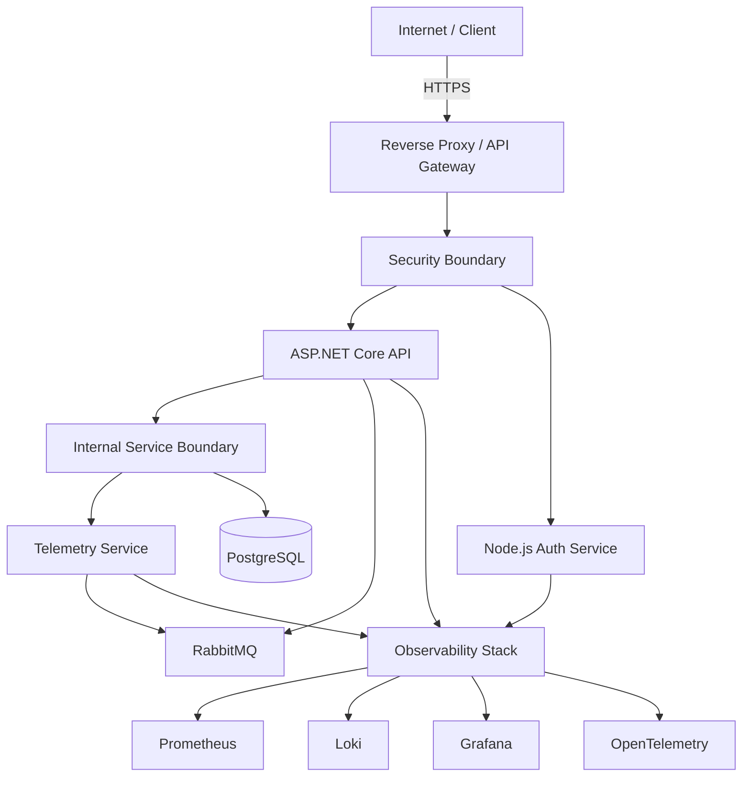

# NEXUS — Distributed Systems & Network Architecture Laboratory

> A containerized distributed platform demonstrating application architecture, network segmentation, service communication, security boundaries, and observability.

## Overview

**NEXUS** is a hands-on distributed systems and infrastructure laboratory designed to explore how modern software applications operate across multiple services, networks, and infrastructure components.

The project combines application development with infrastructure and networking concepts to create a realistic multi-service environment.

Rather than treating the application, network, infrastructure, and monitoring layers as separate concerns, NEXUS brings them together into a single engineering project.

The platform will progressively introduce:

* Containerized application services
* Service-to-service communication
* Network segmentation
* Reverse proxy and API gateway architecture
* Authentication and authorization
* Database infrastructure
* Asynchronous messaging
* Logging and metrics
* Distributed tracing
* Failure testing and recovery
* Linux-based deployment
* Infrastructure and operational documentation

---

## Why NEXUS?

NEXUS was created as a bridge between **application development** and **infrastructure/network/system design**.

The project provides an environment for applying software development knowledge to problems involving:

* Distributed applications
* Network architecture
* Infrastructure design
* Service isolation
* Security boundaries
* System observability
* Reliability
* Failure recovery
* Deployment and operations

The goal is not simply to build an application, but to understand **how the components of a distributed system communicate, depend on one another, and behave when parts of the system fail**.

---

## Architecture

The planned high-level architecture is:



The architecture will evolve throughout the project as additional infrastructure and distributed-system concepts are introduced.

---

## Core Architecture Principles

NEXUS will be developed around several engineering principles.

### Separation of Concerns

Application logic, authentication, infrastructure, networking, and observability should have clearly defined responsibilities.

### Least Privilege

Services should only have access to the resources and networks they require.

### Network Segmentation

Different system layers should be isolated into appropriate network boundaries rather than placing every service on a single unrestricted network.

### Observability

The system should provide enough telemetry to understand what is happening internally through metrics, logs, and distributed traces.

### Failure Awareness

A distributed system should be tested under failure conditions rather than only under normal operation.

### Reproducibility

Infrastructure should be defined as configuration wherever practical so that the environment can be recreated consistently.

### Documentation as Engineering

Architecture diagrams, design decisions, testing evidence, and lessons learned will be maintained alongside the implementation.

---

## Technology Stack

| Area                    | Technology         |
| ----------------------- | ------------------ |
| Primary API             | ASP.NET Core       |
| Secondary Service       | Node.js + Express  |
| Database                | PostgreSQL         |
| Containerization        | Docker             |
| Container Orchestration | Docker Compose     |
| Reverse Proxy / Gateway | Traefik or Nginx   |
| Messaging               | RabbitMQ           |
| Metrics                 | Prometheus         |
| Visualization           | Grafana            |
| Logging                 | Loki               |
| Distributed Tracing     | OpenTelemetry      |
| Version Control         | Git + GitHub       |
| Documentation           | Markdown + Mermaid |
| Development Environment | VS Code            |
| Deployment Environment  | Linux VM           |

Technologies will be introduced incrementally rather than all at once.

---

## Planned Network Architecture

The NEXUS environment will progressively introduce network segmentation.

```text
                    Internet / Client
                           |
                         HTTPS
                           |
                           v
                +----------------------+
                | Reverse Proxy /      |
                | API Gateway          |
                +----------------------+
                           |
                    SECURITY BOUNDARY
                           |
              +------------+------------+
              |                         |
              v                         v
       Application Network       Authentication
              |                    Service
        +-----+------+                  |
        |            |                  |
        v            v                  |
       API       Telemetry              |
        |            |                  |
        +-----+------+                  |
              |                         |
        INTERNAL BOUNDARY               |
              |                         |
              v                         |
       Database Network                 |
              |                         |
              v                         |
         PostgreSQL <-------------------+
```

The final network design will be documented with Docker network configuration, connectivity tests, and architecture diagrams.

---

## Planned Capabilities

### Application Services

* ASP.NET Core API
* Node.js authentication service
* Health and readiness endpoints
* PostgreSQL-backed application data

### Networking

* Isolated Docker networks
* Application network
* Database network
* Gateway/edge network
* Controlled service communication
* Network connectivity testing

### Security

* Authentication
* JWT-based authorization
* Role-based access control
* Service communication boundaries
* Secrets and environment configuration
* Security testing

### Distributed Communication

* Synchronous HTTP communication
* RabbitMQ messaging
* Asynchronous telemetry processing
* Message failure handling
* Retry and recovery strategies

### Observability

* Application metrics
* Infrastructure metrics
* Centralized logging
* Distributed tracing
* Grafana dashboards
* Health monitoring

### Reliability

* Service failure testing
* Database failure testing
* Message broker failure testing
* Recovery testing
* Timeouts
* Retries
* Circuit breakers
* Graceful degradation
* Backpressure

---

## Project Roadmap

NEXUS will be developed incrementally.

### Phase 1 — Foundation & Engineering Environment

* Development environment
* Repository structure
* Engineering documentation
* Minimal application services
* Health checks

### Phase 2 — Backend Service Architecture

* ASP.NET Core API
* Node.js authentication service
* PostgreSQL
* Automated tests

### Phase 3 — Containerization

* Dockerfiles
* Docker Compose
* Environment configuration
* Persistent storage

### Phase 4 — Network Architecture & Segmentation

* Docker networks
* Security boundaries
* Service connectivity
* Network isolation testing

### Phase 5 — Reverse Proxy & API Gateway

* Gateway configuration
* Routing
* HTTPS/TLS
* Public/private service boundaries

### Phase 6 — Authentication & Security

* JWT authentication
* RBAC
* Service authentication
* Security testing

### Phase 7 — Distributed Service Communication

* Synchronous service communication
* RabbitMQ
* Asynchronous processing
* Messaging failure scenarios

### Phase 8 — Observability

* Prometheus
* Grafana
* Loki
* OpenTelemetry
* Metrics, logs, and traces

### Phase 9 — Failure Engineering

* Service failures
* Database failures
* Messaging failures
* Recovery behaviour
* Reliability testing

### Phase 10 — Advanced Distributed Architecture

* Multiple API instances
* Load balancing
* Health and readiness
* Timeouts
* Retries
* Circuit breakers
* Graceful degradation
* Backpressure

### Phase 11 — Linux / VM Deployment

* Linux virtual machine
* Docker deployment
* SSH administration
* VM networking
* Firewall configuration
* Remote deployment

### Phase 12 — Portfolio Engineering & Documentation

* Final architecture diagrams
* Network topology
* Request-flow documentation
* Failure scenarios
* Architecture Decision Records
* Testing evidence
* Lessons learned

---

## Repository Structure

The repository is organized to separate application code, infrastructure, testing, documentation, and operational scripts.

```text
nexus-distributed-systems/
│
├── src/
│   └── Application and service source code
│
├── infrastructure/
│   └── Infrastructure and deployment configuration
│
├── docs/
│   ├── architecture/
│   ├── networking/
│   ├── security/
│   ├── infrastructure/
│   └── decisions/
│
├── tests/
│   └── Automated and integration tests
│
├── scripts/
│   └── Development and operational scripts
│
├── .gitignore
└── README.md
```

This structure will evolve as the system grows.

---

## Engineering Workflow

Development will follow an iterative engineering workflow:

```text
Build
  ↓
Test
  ↓
Understand
  ↓
Document
  ↓
Commit
```

Each major milestone should leave behind both **working implementation** and **evidence of how the system was designed and tested**.

Examples of project evidence include:

* Architecture diagrams
* Network diagrams
* Terminal output
* Docker network inspection
* Connectivity tests
* API responses
* Monitoring dashboards
* Failure tests
* Recovery tests
* Git commits
* Architecture Decision Records

---

## Documentation

Architecture and engineering documentation will be maintained under `docs/`.

Planned documentation areas include:

```text
docs/
├── architecture/
├── networking/
├── security/
├── infrastructure/
└── decisions/
```

Architecture decisions will be recorded as **Architecture Decision Records (ADRs)** where appropriate.

---

## Project Status

**Current Phase:** Phase 1 — Foundation & Engineering Environment

**Current Milestone:** Repository & Project Structure

### Completed

* Development workstation preparation
* .NET SDK configuration
* Node.js and npm configuration
* Git configuration
* VS Code configuration
* Docker Desktop configuration
* WSL2 configuration
* GitHub repository creation
* Local Git repository
* Initial repository structure

### In Progress

* Initial project documentation
* Repository foundation
* Minimal service architecture

### Upcoming

* ASP.NET Core service
* Node.js authentication service
* Initial automated tests
* Containerization

---

## Learning Objectives

NEXUS is intended to develop practical understanding of:

* Application architecture
* Distributed systems
* Computer networking
* Containerization
* Network segmentation
* API gateways
* Authentication and authorization
* Message-based communication
* Infrastructure automation
* Observability
* Reliability engineering
* Linux administration
* Deployment
* System troubleshooting

---

## Long-Term Goal

The long-term goal of NEXUS is to demonstrate how a modern distributed application can be **designed, implemented, secured, deployed, observed, tested, and recovered as a complete system**.

The project is intentionally designed to grow from a small collection of services into a progressively more realistic distributed environment.

---

## License

License information will be added once the project's distribution requirements have been finalized.
